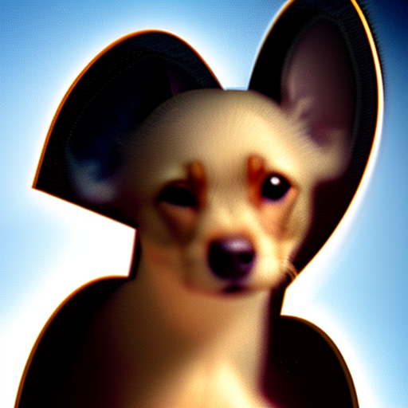
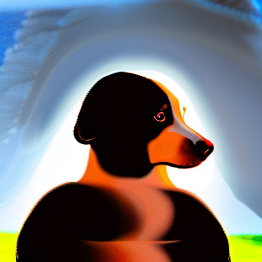
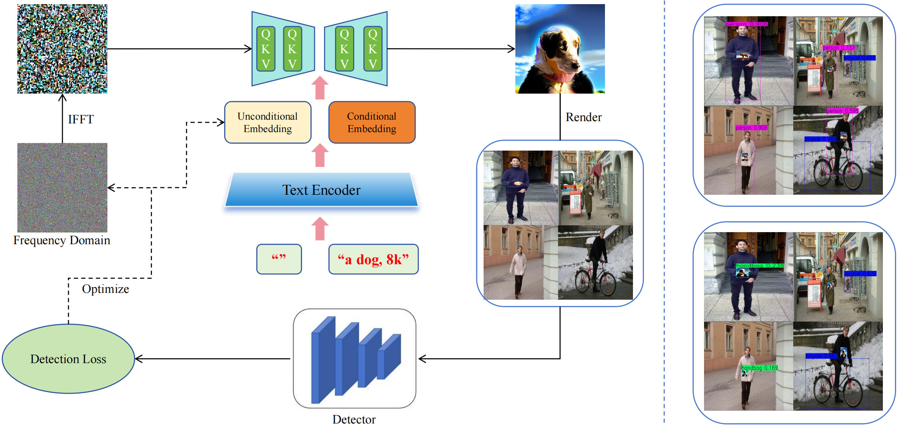

# AdvLogo: Adversarial Patch Attack against Object Detectors based on Diffusion Models
<p align="center">[<a href="https://arxiv.org/abs/2409.07002">Paper</a>]</p>
An official implementation of AdvLogo, the exploration of adversarial capability within the semantic space.

**Demo**

| YOLO v2                                                     | YOLO v3                                                     | YOLO v4                                                     | Faster-RCNN                                                          | SSD                                                          |
|-------------------------------------------------------------|-------------------------------------------------------------|-------------------------------------------------------------|----------------------------------------------------------------------|--------------------------------------------------------------|
|  |  |  |  |  |

**Abstract:** With the rapid development of deep learning, object detectors have demonstrated impressive performance; however, vulnerabilities still exist in certain scenarios. Current research exploring the vulnerabilities using adversarial patches often struggles to balance the trade-off between attack effectiveness and visual quality. To address this problem, we propose a novel framework of patch attack from semantic perspective, which we refer to as AdvLogo. Based on the hypothesis that every semantic space contains an adversarial subspace where images can cause detectors to fail in recognizing objects, we leverage the semantic understanding of the diffusion denoising process and drive the process to adversarial subareas by perturbing the latent and unconditional embeddings at the last timestep. To mitigate the distribution shift that exposes a negative impact on image quality, we apply perturbation to the latent in frequency domain with the Fourier Transform. Experimental results demonstrate that AdvLogo achieves strong attack performance while maintaining high visual quality.

**Framework Overview**


## Environment

```bash
conda create -n advlogo python=3.8
conda activate advlogo
pip install -r requirements.txt
```

## Data and Pretrained Models
**Data**:

| Data        |                                             Generated Labels                                             |                                              Source                                              |                                            
|-------------|:--------------------------------------------------------------------------------------------------------:|:------------------------------------------------------------------------------------------------:|
| INRIAPerson |  [GoogleDrive](https://drive.google.com/drive/folders/1zKO6yXllhReiDS04WKkb6JIkxvAW2s_9?usp=share_link)  |               [Paper](https://hal.inria.fr/docs/00/54/85/12/PDF/hog_cvpr2005.pdf)                |

See more details in [Docs](./readme/data.md).

**Weights of Object Detectors**:

Pleses refer to [README](./detlib/README.md) for more details.

**Diffusion Models**:

The Stable Diffusion 2.1 can be accessed from [here](https://huggingface.co/stabilityai/stable-diffusion-2-1).
You can download the model and place it in the directiory
- AdvLogo/
  - /stable-diffusion-2-1
      - /feature_extractor
      - /scheduler
      - /text_encoder
      - /tokenizer
      - ...
  - /configs
  - ...

## Run
#### Evaluation

The evaluation metrics of the **Mean Average Precision([mAP](https://github.com/Cartucho/mAP))** is provided.
You can run the demo script directly:
```bash
bash ./scripts/eval.sh 
```
Or you can run the full command:
```bash
python evaluate.py \
-p ./results/v3-dog.png \
-cfg ./configs/eval/coco80.yaml \
-lp ./data/INRIAPerson/Test/labels \
-dr ./data/INRIAPerson/Test/pos \
-s ./data/test \
-ud # if you want to use SAC
-e 0
```

#### Training
To train the AdvLogo, you can run the following command:
```bash
bash ./scripts/train_advlogo.sh
```
Or you can run the full command:
```bash
python train_fgsm.py -np \
-cfg=advlogo/v3.yaml \
-s=./results/advlogo/v3 \
-n=v3-dog \
--seed=33 \
--prompt="a dog, 8k"
```
The default save path of tensorboard logs is **runs/**. Yo can modify the config .yaml files for custom settings.

## Acknowledgements
The competitive methods of AdvLogo are as follows:
* AdvPatch - [**Paper**](http://openaccess.thecvf.com/content_CVPRW_2019/papers/CV-COPS/Thys_Fooling_Automated_Surveillance_Cameras_Adversarial_Patches_to_Attack_Person_Detection_CVPRW_2019_paper.pdf) 
| [Source Code](https://gitlab.com/EAVISE/adversarial-yolo)
* NAP - [**Paper**](https://openaccess.thecvf.com/content/ICCV2021/papers/Hu_Naturalistic_Physical_Adversarial_Patch_for_Object_Detectors_ICCV_2021_paper.pdf) 
| [Source Code](https://github.com/aiiu-lab/Naturalistic-Adversarial-Patch)

This project is built upon and adapted from the [T-SEA](https://github.com/VDIGPKU/T-SEA) repository. Special thanks to the contributors of the original project for their valuable codebase.
## Citation
If you find this work useful, please consider citing:
```
@article{miao2024advlogo,
  title={AdvLogo: Adversarial Patch Attack against Object Detectors based on Diffusion Models},
  author={Miao, Boming and Li, Chunxiao and Zhu, Yao and Sun, Weixiang and Wang, Zizhe and Wang, Xiaoyi and Xie, Chuanlong},
  journal={arXiv preprint arXiv:2409.07002},
  year={2024}
}
```
We would really appreciate it if you could give a star to this repository.

## License

The project is only free for academic research purposes, but needs authorization forcommerce. For commerce permission, please contact bomingmiao@gmail.com.
